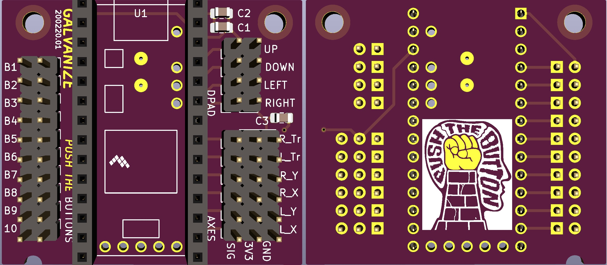

# xinput_controller

## Installation

Getting the xinput libraries working is a bit of a process.
Last tested with the following software baslines:
  - Teensyduino 1.50: https://www.pjrc.com/teensy/td_150/TeensyduinoInstall.exe
  - Arduino 1.8.11: https://www.arduino.cc/en/main/OldSoftwareReleases
  - ArduinoXInput_Teensy 1.0.6: https://github.com/dmadison/ArduinoXInput_Teensy/releases
  - ArduinoXInput v1.2.1: https://github.com/dmadison/ArduinoXInput  (installable through ARduino Tools > Manage Libraries)
 
Follow the installation instructions for ArduinoXInput library found [in its repo](https://github.com/dmadison/ArduinoXInput_Teensy)

## PCB

* KiCAD project files and gerbers are [here](https://github.com/jcorcoran/xinput_controller/tree/master/pcb/galvanize)
* Also available for easy one-click ordering from: https://oshpark.com/shared_projects/lwcYD8mQ

Generic breakout board for a typical xinput device that provides the following on 0.1" pitch headers:
   * 10x discrete button input channels
   * 4x discrete D-Pad inputs (Up, Down, Left, Right)
   * 6x analog input channels (Right Axis X & Y, Left Axis X & Y, Left & Right Triggers)

### Bill of materials:

  * 1x - Teensy LC
  * 2x - 1x14 0.1" pitch female pin headers
  * 14x - 1x2 0.1" pitch male pin headers
  * 6x - 1x3 0.1" pitch male pin headers
  * C1, C2, C3 filter caps are optional
